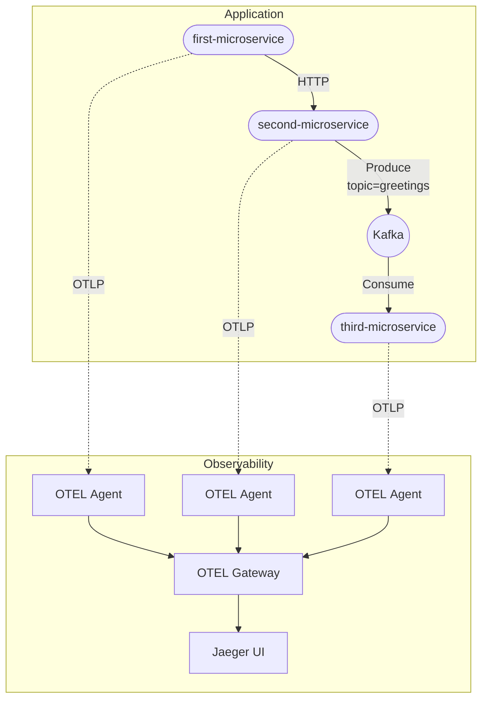

# OpenTelemetry Distributed Tracing Demo

This repository hosts **three Spring Boot 3.4+ (Java 21) microservices** showcasing end‑to‑end *distributed tracing* with **OpenTelemetry**.  
All required infrastructure (Kafka, Zookeeper, OpenTelemetry Collector + Gateway, Jaeger) is orchestrated via **Docker Compose**; an equivalent stack for **Kubernetes** is provided under `charts/`.

> **Goal**  
> Demonstrate automatic trace context propagation in two scenarios:  
> 1. **Synchronous HTTP** — `first‑microservice` → `second‑microservice`.  
> 2. **Asynchronous messaging** — `second‑microservice` → Kafka → `third‑microservice`.

---

## Architecture Overview



---

## Repository Layout

```
.
├── compose.yaml                 # Local docker‑compose stack
├── collector/
│   ├── agent-config.yaml        # OTEL Agent settings
│   └── gateway-config.yaml      # OTEL Gateway (central processor)
├── first-microservice/          # 4 HTTP endpoints
├── second-microservice/         # 2 HTTP endpoints + Kafka producer
├── third-microservice/          # Kafka consumer
└── charts/                      # Helm charts (optional – K8s)
```

---

## Environment Variables

### first‑microservice

| Variable | Value (compose) | Description |
|----------|-----------------|-------------|
| `SECOND_MICROSERVICE_URI` | `http://second-microservice:8080` | Base URL used to call the *second‑microservice*. |
| `OTEL_SERVICE_NAME` | `first-microservice` | Service name reported in traces. |
| `OTEL_EXPORTER_OTLP_ENDPOINT` | `http://host.docker.internal:4318` | OTLP endpoint the agent pushes spans to. |
| `OTEL_EXPORTER_OTLP_PROTOCOL` | `http/protobuf` | OTLP protocol used. |
| `OTEL_METRICS_EXPORTER` / `OTEL_LOGS_EXPORTER` | `none` | Disables metrics and logs export. |
| `JAVA_TOOL_OPTIONS` | `-javaagent:/otel/otel.jar` | Injects the Java auto‑instrumentation agent. |

### second‑microservice

| Variable | Value (compose) | Description |
|----------|-----------------|-------------|
| `KAFKA_BOOTSTRAP_SERVERS` or `SPRING_KAFKA_BOOTSTRAP_SERVERS` | `kafka:19092` | Kafka broker address used by the *producer*. |
| `OTEL_SERVICE_NAME` | `second-microservice` | Service name in traces. |
| Other `OTEL_*` vars | same as above | Same meaning as in the first service. |

### third‑microservice

| Variable | Value (compose) | Description |
|----------|-----------------|-------------|
| `SPRING_KAFKA_BOOTSTRAP_SERVERS` | `kafka:19092` | Kafka broker address used by the *consumer*. |
| `OTEL_SERVICE_NAME` | `third-microservice` | Service name in traces. |
| Other `OTEL_*` vars | same as above | Same meaning as in the first service. |

> **Note:** `OTEL_*` values can be overridden as needed (e.g., to tweak sampling or backend).

---

## Quick Start

1. **Prerequisites**  
   * Docker Desktop ⩾ 4.x  
   * `docker compose` CLI  
   * (Optional) `kcat` for Kafka tests

2. **Spin up the stack**

   ```bash
   docker compose up --build -d
   ```

   Available services:

   | Service               | URL / Port                 | Notes                              |
   |-----------------------|----------------------------|------------------------------------|
   | Jaeger UI             | http://localhost:16686   | Explore traces here                |
   | first‑microservice    | http://localhost:8080    | `/greetings/*` endpoints           |
   | second‑microservice   | http://localhost:8081    | `/greetings/*` endpoints           |
   | third‑microservice    | —                          | Kafka consumer only                |
   | Kafka (PLAINTEXT)     | localhost:9092           | Exposed for local testing          |

3. **Generate traces**

   ```bash
   curl http://localhost:8080/greetings/hello-second-microservice
   ```

   *A root span is created and travels across the three services.*  
   In Jaeger, filter by **service = `first-microservice`**.

4. **Publish messages directly (optional)**

   ```bash
   kcat -P -b localhost:9092 -t greetings <<< "Hello from terminal"
   ```

---

## API Reference

### first‑microservice – port 8080

| Method | Route                                   | Description                           |
|--------|-----------------------------------------|---------------------------------------|
| `GET`  | `/greetings/hello`                     | Simple local response                 |
| `GET`  | `/greetings/goodbye`                   | Simple local response                 |
| `GET`  | `/greetings/hello-second-microservice` | Proxies call to `second‑microservice` |
| `GET`  | `/greetings/goodbye-second-microservice` | Same as above                      |

### second‑microservice – port 8081

| Method | Route            | Description |
|--------|------------------|-------------|
| `GET`  | `/greetings/hello` | `Thread.sleep(10 s)` **+** produces `"Hello World"` |
| `GET`  | `/greetings/goodbye` | Produces `"Goodbye"` |

### third‑microservice

No HTTP endpoints — only `@KafkaListener(topics = "greetings")`.

---

## OTEL Instrumentation Details

* **Java auto‑instrumentation**: each Dockerfile injects the *javaagent* (`otel.jar`) via `JAVA_TOOL_OPTIONS`.
* **Collector/Agent**  
  * `agent-config.yaml` – scrapes spans from each service container and pushes to Gateway.  
  * `gateway-config.yaml` – processors (filtering, tail‑sampling) and export to Jaeger (`grpc/4317`, `http/4318`).
* **Sampling strategies**: tweak `tail_sampling` processor inside `gateway-config.yaml`.

---

## Deploying to Kubernetes

```bash
helm install otel-demo ./charts  --namespace observability
```

---

## Next Steps

* Enable **OpenTelemetry Metrics & Logs**.
* Add **resilience patterns** (circuit breaker, retries) and observe their spans.
* Try alternative backends (Tempo, Elastic APM, Grafana Loki).

---

## License

[MIT](LICENSE)
